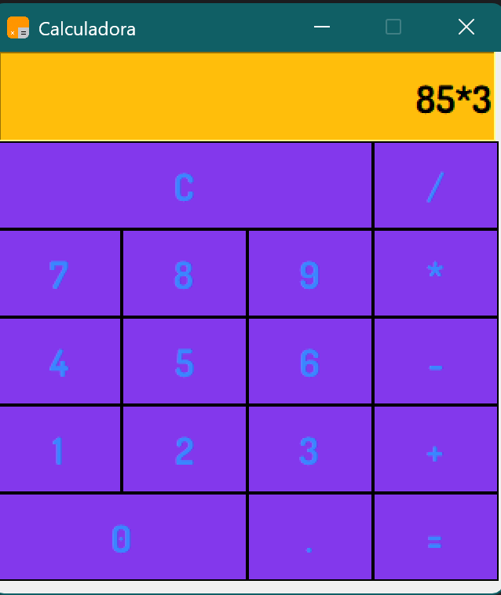

# Calculadora en Python (Tkinter)

Aplicación de calculadora con interfaz gráfica desarrollada en Python utilizando Tkinter.

---

## Funcionalidades

- Operaciones básicas (+, -, *, /)  
- Interfaz gráfica interactiva  
- Manejo de errores en operaciones  

---

## Tecnologías

Python · Tkinter

---

## Descripción

La aplicación permite ingresar expresiones mediante botones y calcular el resultado en tiempo real a través de eventos en la interfaz.

---

## Autor

Aikov Marín
